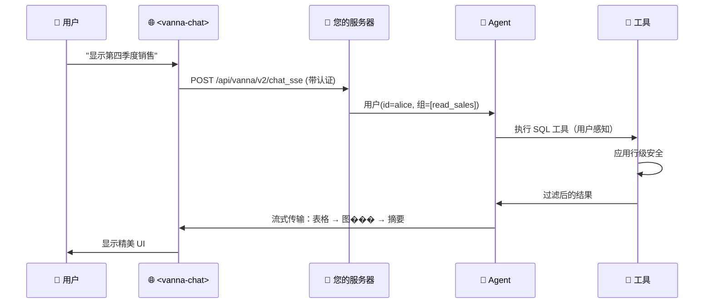

# Vanna 2.0：将问题转化为数据洞察

**自然语言 → SQL → 答案。** 现在包含企业级安全和用户感知权限。

[](https://python.org)
[](LICENSE)
[](https://github.com/psf/black)

https://github.com/user-attachments/assets/476cd421-d0b0-46af-8b29-0f40c73d6d83


---

## 2.0 新特性

🔐 **全层用户感知** — 查询根据用户权限自动过滤

🎨 **现代 Web 界面** — 精美的预置 `<vanna-chat>` 组件

⚡ **流式响应** — 实时表格、图表和进度更新

🔒 **企业级安全** — 行级安全、审计日志、速率限制

🔄 **生产就绪** — FastAPI 集成、可观察性、生命周期钩子

> **从 0.x 升级？** 请查看 [迁移指南](MIGRATION_GUIDE.md) | [有什么变化？](#迁移说明)

---

## 快速开始

### 使用示例数据试用

[快速开始](https://vanna.ai/docs/quick-start)

### 配置

[配置](https://vanna.ai/docs/configure)

### Web 组件

```html
<!-- 放入任何现有网页 -->
<script src="https://img.vanna.ai/vanna-components.js"></script>
<vanna-chat
  sse-endpoint="https://your-api.com/chat"
  theme="dark">
</vanna-chat>
```

使用您现有的 cookies/JWT。支持 React、Vue 或纯 HTML。

---

## 您将获得什么

用自然语言提问并获得：

**1. 流式进度更新**

**2. SQL 代码块（默认仅显示给"admin"用户）**

**3. 交互式数据表**

**4. 图表**（Plotly 可视化）

**5. 自然语言摘要**

所有内容实时流式传输到您的 Web 组件。

---

## 为什么选择 Vanna 2.0？

### ✅ 即时上手
* 生产级聊天界面
* 与您的数据库自定义 Agent
* 嵌入任何网页

### ✅ 企业级安全
**全层用户感知** — 身份流经系统提示、工具执行和 SQL 过滤
**行级安全** — 查询根据用户权限自动过滤
**审计日志** — 每个用户的每次查询都被跟踪以满足合规要求
**速率限制** — 通过生命周期钩子实现每用户配额

### ✅ 精美 Web UI
**预置 `<vanna-chat>` 组件** — 无需构建自己的聊天界面
**流式表格和图表** — 丰富的组件，不只是文本
**响应式且可定制** — 支持移动端、桌面端、浅色/深色主题
**框架无关** — React、Vue、纯 HTML

### ✅ 兼容您的技术栈
**任意 LLM：** OpenAI、Anthropic、Ollama、Azure、Google Gemini、AWS Bedrock、Mistral 等
**任意数据库：** PostgreSQL、MySQL、Snowflake、BigQuery、Redshift、SQLite、Oracle、SQL Server、DuckDB、ClickHouse 等
**您的认证系统：** 支持 cookies、JWTs、OAuth tokens
**您的框架：** FastAPI、Flask

### ✅ 可扩展但不随意
**自定义工具** — 扩展 `Tool` 基类
**生命周期钩子** — 配额检查、日志、内容过滤
**LLM 中间件** — 缓存、提示词工程
**可观察性** — 内置追踪和指标

---

## 架构


---

## 工作原理



**核心概念：**

1. **用户解析器** — 您定义如何从请求中提取用户身份（cookies、JWTs 等）
2. **用户感知工具** — 工具根据用户组成员资格自动检查权限
3. **流式组件** — 后端将结构化 UI 组件（表格、图表）流式传输到前端
4. **内置 Web UI** — 预置 `<vanna-chat>` 组件精美渲染所有内容

---

## 生产环境设置与您的认证集成

这是一个将 Vanna 与您现有的 FastAPI 应用和认证集成的完整示例：

```python
from fastapi import FastAPI
from vanna import Agent
from vanna.servers.fastapi.routes import register_chat_routes
from vanna.servers.base import ChatHandler
from vanna.core.user import UserResolver, User, RequestContext
from vanna.integrations.anthropic import AnthropicLlmService
from vanna.tools import RunSqlTool
from vanna.integrations.sqlite import SqliteRunner
from vanna.core.registry import ToolRegistry

# 您现有的 FastAPI 应用
app = FastAPI()

# 1. 定义您的用户解析器（使用您的认证系统）
class MyUserResolver(UserResolver):
    async def resolve_user(self, request_context: RequestContext) -> User:
        # 从 cookies、JWTs 或会话中提取
        token = request_context.get_header('Authorization')
        user_data = self.decode_jwt(token)  # 您的现有逻辑

        return User(
            id=user_data['id'],
            email=user_data['email'],
            group_memberships=user_data['groups']  # 用于权限检查
        )

# 2. 设置 Agent 和工具
llm = AnthropicLlmService(model="claude-sonnet-4-5")
tools = ToolRegistry()
tools.register(RunSqlTool(sql_runner=SqliteRunner("./data.db")))

agent = Agent(
    llm_service=llm,
    tool_registry=tools,
    user_resolver=MyUserResolver()
)

# 3. 将 Vanna 路由添加到您的应用
chat_handler = ChatHandler(agent)
register_chat_routes(app, chat_handler)

# 现在您拥有：
# - POST /api/vanna/v2/chat_sse（流式端点）
# - GET /（可选 Web UI）
```

**然后在您的前端：**
```html
<vanna-chat sse-endpoint="/api/vanna/v2/chat_sse"></vanna-chat>
```

查看 [完整文档](https://vanna.ai/docs) 了解自定义工具、生命周期钩子和高级配置

---

## 自定义工具

使用自定义工具扩展 Vanna 以满足您的特定用例：

```python
from vanna.core.tool import Tool, ToolContext, ToolResult
from pydantic import BaseModel, Field
from typing import Type

class EmailArgs(BaseModel):
    recipient: str = Field(description="邮件收件人")
    subject: str = Field(description="邮件主题")

class EmailTool(Tool[EmailArgs]):
    @property
    def name(self) -> str:
        return "send_email"

    @property
    def access_groups(self) -> list[str]:
        return ["send_email"]  # 权限检查

    def get_args_schema(self) -> Type[EmailArgs]:
        return EmailArgs

    async def execute(self, context: ToolContext, args: EmailArgs) -> ToolResult:
        user = context.user  # 自动注入

        # 您的业务逻辑
        await self.email_service.send(
            from_email=user.email,
            to=args.recipient,
            subject=args.subject
        )

        return ToolResult(success=True, result_for_llm=f"邮件已发送到 {args.recipient}")

# 注册您的工具
tools.register(EmailTool())
```

---

## 高级功能

Vanna 2.0 包含强大的企业级功能，用于生产环境：

**生命周期钩子** — 在请求生命周期的关键点添加配额检查、自定义日志、内容过滤

**LLM 中间件** — 在 LLM 调用周围实现缓存、提示词工程或成本跟踪

**对话存储** — 持久化和检索每个用户的对话历史

**可观察性** — 内置追踪和指标集成

**上下文增强器** — 添加 RAG、内存或文档以增强 Agent 响应

**Agent 配置** — 控制流式、温度、最大迭代次数等

---

## 使用场景

**Vanna 非常适合：**
- 📊 具有自然语言界面的数据分析应用
- 🔐 需要用户感知权限的多租户 SaaS
- 🎨 想要预置 Web 组件 + 后端的团队
- 🏢 具有安全/审计要求的企业环境
- 📈 需要丰富流式响应（表格、图表、SQL）的应用
- 🔄 与现有认证系统集成

---

## 社区与支持

- 📖 **[完整文档](https://vanna.ai/docs)** — 完整指南和 API 参考
- 💡 **[GitHub 讨论](https://github.com/vanna-ai/vanna/discussions)** — 功能请求和问答
- 🐛 **[GitHub 问题](https://github.com/vanna-ai/vanna/issues)** — 错误报告
- 📧 **企业支持** — support@vanna.ai

---

## 迁移说明

**从 Vanna 0.x 升级？**

Vanna 2.0 是一个完全重写，专注于用户感知的 Agent 和生产部署。主要变化：

- **新 API**：基于 Agent 而不是 `VannaBase` 类方法
- **用户感知**：每个组件现在都知道用户身份
- **流式传输**：丰富的 UI 组件而不是文本/数据框
- **Web 优先**：内置 `<vanna-chat>` 组件和服务器

**迁移路径：**

1. **快速包装** — 使用 `LegacyVannaAdapter` 包装您现有的 Vanna 0.x 实例，立即获得新的 Web UI
2. **逐步迁移** — 逐步迁移到新的 Agent API 和工具

请查看完整的 [迁移指南](MIGRATION_GUIDE.md) 获取分步说明。

---

## 许可证

MIT 许可证 — 查看 [LICENSE](LICENSE) 了解详情。

---

**用 ❤️ 由 Vanna 团队构建** | [网站](https://vanna.ai) | [文档](https://vanna.ai/docs) | [讨论](https://github.com/vanna-ai/vanna/discussions)